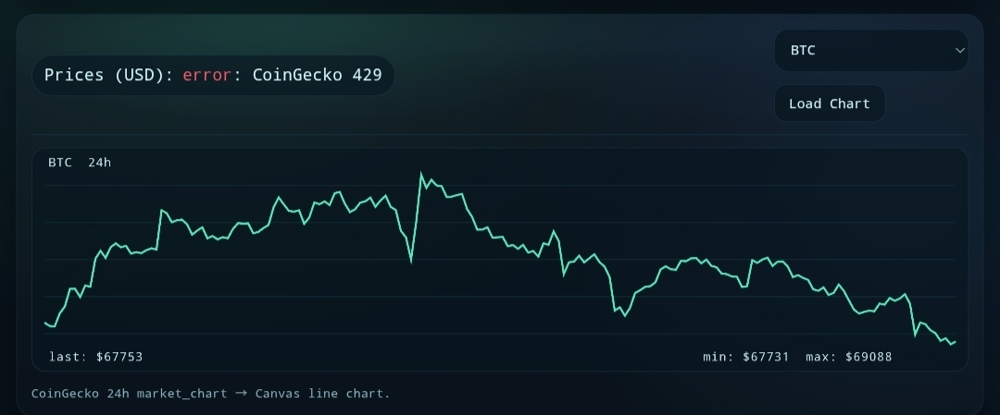
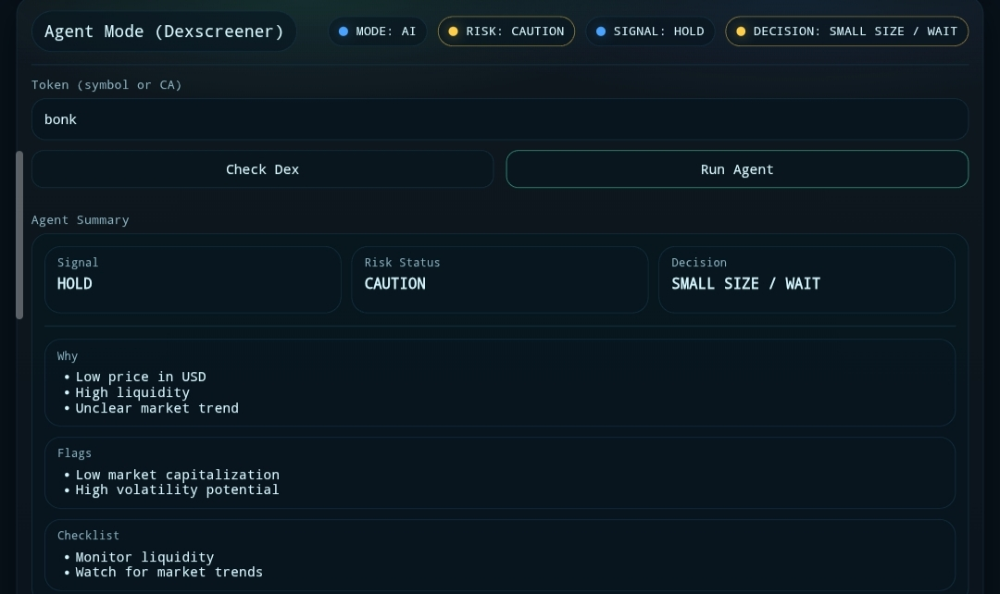
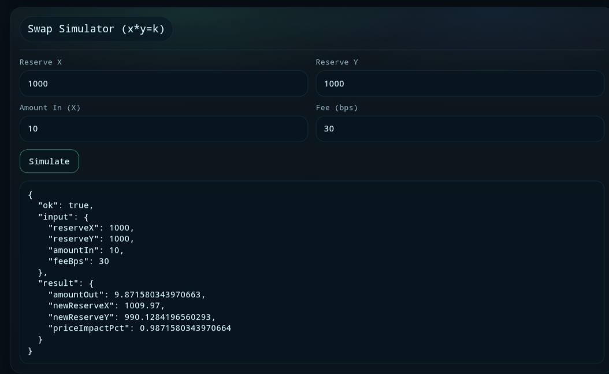

# ⚡ INTERCOM_BY_GRIMORE8 — AI Trading Copilot Dashboard

## 📍 Trac Address
trac1g2afss6v96du6jkuptl9gzv2c9g0n7lsn9sqx0u3639zgmx38nrs9lnqtz

---

## 🚀 Overview

INTERCOM_BY_GRIMORE8 is a high-performance **CLI + Web Dashboard AI Trading Copilot** built on an Intercom-style multi-agent architecture.

It combines real-time market intelligence with a clean, proof-friendly interface:

- Real-time token snapshot (Dexscreener)
- Analyst Agent (signal generator)
- Risk Gate Agent (safety filter)
- Token chart pipeline (DEX → OHLCV)
- Price chart (CoinGecko)
- Swap simulator (x*y=k model)

---

## ⚙️ What It Does

### 🧠 Multi-Agent Output (Core)
The system always produces:

- **SIGNAL** → BUY / HOLD / SELL  
- **RISK** → SAFE / CAUTION / BLOCK  
- **DECISION** → actionable next step

Visual status:
- 🟢 SAFE (proceed)
- 🟡 CAUTION (small size / wait)
- 🔴 BLOCK (do not trade)

### 🌐 Dashboard Mode (Web UI)
A clean, responsive dashboard providing:

- SOL balance + recent transactions
- BTC / ETH / SOL prices + 24h chart
- Token chart (Dexscreener → GeckoTerminal OHLCV)
- Agent panel (Signal / Risk / Decision + warning colors)
- Swap simulator (constant product model)

### 💻 CLI Mode (Terminal)
Minimal CLI interaction:

```
1. Agent Mode (Real Data + Q&A)
2. Swap (Link Generator)
3. Risk Check (Real Data)
4. Exit
```

### 🔗 Swap Link Generator (Safe Mode)
- Generates swap links only
- No wallet connection
- No transaction execution

Example:
```
https://jup.ag/swap/TOKEN-SOL
```

---

## 📌 Agent Output Format

```
SIGNAL: HOLD
RISK: CAUTION
DECISION: SMALL SIZE / WAIT

WHY:
- high volume but unclear direction
- liquidity is acceptable but not strong

FLAGS:
- low liquidity vs volume ratio

CHECKLIST:
- verify contract address (CA)
- check liquidity depth
- check top holders
- start with a small test
```

---

## 📸 Proof (Screenshots)

Upload screenshots into `./assets/` using these exact filenames:

- `assets/proof-dashboard-wallet.jpg`
- `assets/proof-prices-chart.jpg`
- `assets/proof-token-chart.jpg`
- `assets/proof-agent-mode.jpg`
- `assets/proof-swap-simulator.jpg`

Then they render here:

### Dashboard + Wallet


### Prices + 24h Chart


### Token Chart (DEX → OHLCV)


### Agent Mode (Signal/Risk/Decision)


### Swap Simulator


---

## 🖥️ VPS Installation

### 1) System dependencies
```bash
sudo apt update -y
sudo apt install -y git curl
```

### 2) Install Node.js (recommended: Node 20)
```bash
curl -fsSL https://deb.nodesource.com/setup_20.x | sudo -E bash -
sudo apt install -y nodejs
node -v
npm -v
```

### 3) Clone + install
```bash
git clone https://github.com/grimore8/intercom_by_grimore8.git
cd intercom_by_grimore8
npm install
```

---

## ▶️ Run (VPS)

### Run Dashboard (Web UI)
```bash
npm run dashboard
```

Expected output:
```text
Dashboard running: http://127.0.0.1:8788
Agent mode: Fallback (no API)
```

Open in browser:
```text
http://YOUR_VPS_IP:8788
```

### Run CLI (Terminal)
```bash
node index.js
```

---

## 🔧 Troubleshooting (VPS)

### Port already in use (EADDRINUSE)
```bash
lsof -i :8788
kill -9 <PID>
```

### Open firewall port
```bash
sudo ufw allow 8788/tcp
sudo ufw reload
```

---

## 🔑 Optional AI (Groq)

This app works without keys (fallback logic).  
To enable AI-assisted agent mode:

```bash
export GROQ_API_KEY="YOUR_GROQ_API_KEY"
export GROQ_MODEL="llama-3.3-70b-versatile"
npm run dashboard
```

---

## 🔒 Security Model

- No private key usage
- Read-only analysis + charts
- Swap is simulation / link generation only
- Safe for demos and evaluation

---

## 🎯 Goal

Build a lightweight, deployable AI trading assistant that:
- Improves decision clarity
- Reduces risk exposure
- Preserves Intercom-style interaction
- Produces clean proof screenshots

---

## ⚠️ Disclaimer

This tool is for educational and experimental purposes only.  
Always do your own research before trading.
